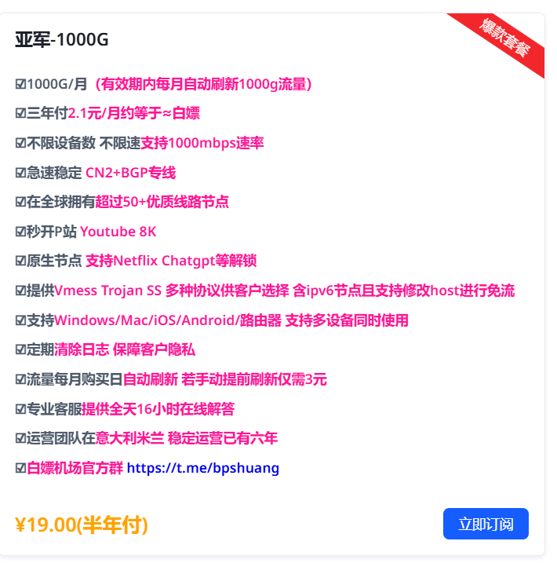

# 成都中医药大学 · 医学信息工程 学习资料库

> 本仓库**专供成都中医药大学（CDUTCM）医学信息工程专业**的学弟学妹复习使用。

做这件事的初衷很简单：**减轻复习压力，提高复习效率。**

大学里很多课的复习，难的不是知识本身，而是**根本不知道考什么、重点在哪、题目长什么样**。
我把自己大学几年攒下来的课件、复习提纲、模拟题和往年题都整理在这里，
希望你能少走一点弯路，把时间花在真正该花的地方。

> ⚠️ **先说清楚：我不能保证你拿高分。**
> 资料只是工具，不是答案。考试范围每年都可能变，老师的重点也可能调整，
> 请务必以**当年老师讲的内容和最新通知**为准。
> 这些资料的价值在于帮你快速建立框架、找到方向，而不是代替你复习。

**联系方式：tjun5411@gmail.com**

---

## 📢 欢迎补充：让这份资料一直活下去

一个人的力量是有限的，我一个人的笔记也一定有我漏掉、记错、或者当年根本没听懂的地方。

所以**非常欢迎各位学弟学妹把自己收集到的学习资料发给我**——
可以是课件、复习提纲、思维导图、往年题、模拟卷、实验报告模板，
也可以只是你整理的一份错题本，甚至是"这门课怎么复习比较好"的经验总结。

**只要你愿意分享，我都会整理后补充进这个仓库，造福后来的学弟学妹。**

📮 发送到：**tjun5411@gmail.com**

如果是比较大的文件（比如视频、模型、大体积 PPT），也欢迎先发邮件告诉我，
我们可以商量一个方便的传输方式。

> 每一届都补一点，这份资料就会越来越厚实。
> 你今天从这里拿到的东西，将来也可以成为别人的起点。

---

## 📂 仓库结构

按学期和课程组织，方便按需查找：

| 目录 | 包含课程 | 文件数 | 大小 |
| --- | --- | ---: | ---: |
| `html/` | **各科在线刷题 / 模拟测试页面**（含解析） | 181 | 1.4 MB |
| `大一上/` | C语言、中医药、军事、数字医疗概论、计导 | 160 | 13.1 MB |
| `大一下/` | 医疗信息系统、数据结构、计算机网络、马原、期末复习 | 58 | 245.0 MB |
| `大二上/` | Java、Python、医用物理学、单片机、操作系统、网络规划与设计、近代史 | 468 | 199.4 MB |
| `大二下/` | 3D MAX、webview端开发、数据挖掘与分析、网络技术 | 164 | 248.2 MB |

### 🔥 强烈推荐：`html/` 刷题系统

这是我认为**最省复习时间**的部分。里面是按科目分好的网页版刷题 / 模拟测试页面，
**不需要装任何软件，直接双击用浏览器打开就能做题，而且大部分带解析。**

覆盖科目：数据结构、数据分析、数据库、Java、JSP、近代史 / 现代史、网络规划、Python、Web前端。

建议的使用方式：先过一遍课件建立印象，再用它刷题找到薄弱点，比干啃课本快得多。

---

## 📥 如何把资料拿到手

> ⚠️ 先说一个 GitHub 的坑：**官方不支持单独下载一个文件夹**，只能下单个文件、或者把整个仓库打包（330 MB）。
> 但下面前两种方式都能让你**只拿到自己需要的那几门课**。

### 方式一：只取某几门课（推荐 ⭐ 需要装 git）

用 `git sparse-checkout`，只下载你指定的目录，其余完全不拉：

```bash
# 第 1 步：只拉目录结构，不下载文件内容（几秒就完）
git clone --depth 1 --filter=blob:none --sparse https://github.com/tjun5411-oss/cdutcm-medical-informatics.git
cd cdutcm-medical-informatics

# 第 2 步：写出你需要的目录，可以写多个
git sparse-checkout set "大二上/java" "html/JSP" "大二下/数据挖掘与分析"
```

**实测效果**：只要 `大二上/java` 时**总共约 17 MB**；再加另外两个目录约 26 MB。
相比完整克隆的 **330 MB**，省下 90% 以上，在国内的网速下差别非常明显。

以后想再补几个目录：

```bash
git sparse-checkout add "大二上/单片机"
```

想同步最新资料：

```bash
git pull
```

哪天想要完整仓库了：

```bash
git sparse-checkout disable
```

还没装 git？去 **https://git-scm.com/download/win** 下载安装，一路默认即可。

### 方式二：不会 git → 下载整个 ZIP

1. 仓库首页点右上角绿色的 **`< > Code`** 按钮
2. 选 **Download ZIP**
3. 解压就能用，不需要装任何东西

> 约 330 MB，网速慢要等一会儿。
> **只要几个文件的话别下 ZIP**，直接点进去单独下载更快。

### 方式三：只要一两个文件

点进目录 → 点开文件 → 点右上角的**下载图标**（Download raw file）。

### 方式四：在线工具下载文件夹（备选）

把文件夹网址粘到 **https://download-directory.github.io/**
不过它现在需要填 GitHub token，对新手不太友好——能用方式一就用方式一。

### ⚠️ `html/` 刷题页面必须下载到本地才能用

GitHub 只会把网页显示成**源代码**，不会渲染成能点击答题的页面。想真正刷题，必须：

1. 把 `html/` 目录（或其中某个子目录）下载到本地
2. **双击 `.html` 文件，用浏览器打开**
3. 就能做题了，不用装任何软件

### 在线直接看

不想下载也可以——GitHub 网页上 `.md` 和代码会直接显示，`.pdf`、`.docx`、`.xlsx` 支持在线预览。
但 `.doc`、`.ppt` 这类较老的格式，需要下载后用 Office 打开。

---

## 🧭 各科资料分布速查

- **C语言 / 数据结构 / 计算机网络** → `大一上/c语言`、`大一下/数据结构`、`大一下/计算机网络`
- **Java** → `大二上/java`（含 6 章课件 PPT + 期末模拟卷）、`html/java`（刷题）
- **Python** → `大二上/python`（含爬虫实训）、`html/python`
- **单片机 / 嵌入式** → `大二上/单片机`（资料最全，含开发工具、厂商例程、课程设计）
- **操作系统 / 网络规划与设计** → `大二上/操作系统`、`大二上/网络规划与设计`
- **3D MAX** → `大二下/3D MAX`（各周模型作业）
- **数据挖掘与分析** → `大二下/数据挖掘与分析`
- **医疗信息系统** → `大一下/医疗信息系统`（含详细设计文档与参考 PDF）
- **马原 / 近代史 / 军事 / 中医药** → 对应学期的文科课程目录

---

## 💡 复习建议

1. **先看目录，别急着全下。** 仓库不小，按你这学期要考的科目去找就行。
2. **优先刷 `html/` 里的题。** 做题比看书更容易发现"我以为我会了"的漏洞。
3. **课件 PPT 用来建框架，PDF / 提纲用来补细节。**
4. **别过度依赖往年题。** 它的作用是提示重点方向，不是预测原题。
5. **早点开始。** 这些资料能提高效率，但没法把三天的复习变成一学期的东西。

---

## 🌐 附：网络环境建议（很重要，别跳过）

大学后面几年，**很多事情都离不开一个能正常访问境外的网络环境**。而且不只是「下资料」这么简单：

- **这个仓库本身** —— 国内直连 GitHub 经常超时、下载极慢，很可能你连 ZIP 都拉不下来
- **创建 Google 账号** —— 大量课程资源、开源工具、在线服务都要用它登录
- **查阅 Google Scholar（谷歌学术）** —— 写课程论文和毕设查文献的主战场，中文文献库覆盖不了英文期刊
- **使用海外的 AI agent / 大模型** —— ChatGPT、Claude、Gemini 等基本都限制中国大陆 IP，做课设、毕设、写代码时效率差别非常大
- **查英文文档** —— 官方文档、Stack Overflow、arXiv、MDN 这些
- **安装依赖** —— pip / npm / conda 的很多源都在境外，速度差好几倍

**建议尽早准备好，别等考试周或者毕设前才临时去找**，那时候最耽误事。

我目前在用的：

> 🔗 **https://yes2.xn--mesv7f5toqlp.biz/register?code=kwpbn0tV**

> 📌 **说明一下**：上面这个是**邀请链接**，你通过它注册，我这边会有一点返利。
> 这个仓库的资料我一直免费放在这里，也不会收任何费用，这个链接就当是给我的一点支持。
> **不强制你用**，你自己有更合适的就用自己的。

### 我买的套餐



**¥19 / 半年**，折下来一个月三块出头，学生党基本没压力。

下面是**商家自己列的参数**（照抄官方说明，我没有逐条实测过）：

| 项目 | 官方说明 |
| --- | --- |
| 流量 | 1000 G / 月，有效期内每月自动刷新 |
| 价格 | 三年付低至 2.1 元/月；我买的是半年付 ¥19 |
| 速率 | 不限速，最高支持 1000 Mbps |
| 线路 | CN2 + BGP 专线，全球 50+ 节点 |
| 协议 | Vmess / Trojan / SS 多协议，含 IPv6 节点 |
| 平台 | Windows / macOS / iOS / Android / 路由器，支持多设备同时在线 |
| 解锁 | 原生节点，支持 Netflix、ChatGPT 等 |
| 客服 | 全天 16 小时在线 |

官方 TG 群：**https://t.me/bpshuang**

> ⚠️ **再强调一次：上面都是商家的宣传，不是我的实测结论。**
> 1000G/月 对学习用途绰绰有余——查文献、用 ChatGPT、拉 GitHub 根本用不完。
> 但「稳定」「高速」这类词任何商家都会写，**实际体验取决于你所在地的网络和节点负载**，
> 建议先买最短周期试试，好用再续。

⚠️ 几句实在话：

- 这只是**我个人在用的**，不代表它最安全、最便宜或最好用，**请你自行判断后再决定**
- **不要**用它做任何违法的事情
- **不要**在上面登录银行、支付这类重要账号
- 预算紧的话，免费的也能凑合，但免费节点通常不稳定，**关键时候掉线真的很折磨人**

---

## ⚠️ 免责声明

- 本仓库资料**仅供学习交流使用**，版权归原作者及各任课老师所有，请勿用于任何商业用途。
- 资料整理自个人学习过程，**可能存在错漏或内容过时**，请以老师课堂讲授和官方通知为准。
- **不保证任何考试成绩。** 请独立复习、诚信应考。
- 部分资料来源于网络，若涉及版权问题，请联系 **tjun5411@gmail.com**，我会立即删除。

---

## 📦 关于大文件

有两个文件因为超过 GitHub 单文件 100MB 的限制未能上传（马原展示 PPT、3D MAX 实验室模型）。
如果需要，请发邮件联系我。详见 [`大文件说明.md`](大文件说明.md)。

---

<p align="center">
  <b>祝复习顺利，考试加油 💪</b><br>
  <sub>也希望你考完之后，回来补一份资料给下一届 ❤️</sub>
</p>
